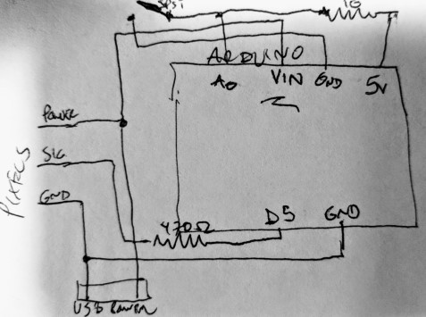

# wearable-pixels
Code and wiring diagrams for wearable projects based on strands of pixels (WS2811)

## Repository structure
* ./arduino: most of the code
* ./images: project images
* ./documents: documentation and notes

## Key files
* ./arduino/stafflight/stafflight.ino: main arduino sketch for lighted staff (SOAK 2019)
* ./arduino/packmatrix/packmatrix.ino: reference arduino sketch from backpack lights (Critical 2018)

# Initial Plan (5/12/19)
There will be one set of pixel strips wrapped around a staff.
* Approximate light locations will be measured empirically
* The top of the staff will have a fixture (probably a stuffed animal) holding the board and battery.
* Button 1 will switch between programs
* Button 2 will be a parameter for the current program.

This sketch shows the wiring for the Pixel strand using an external USB power source:

